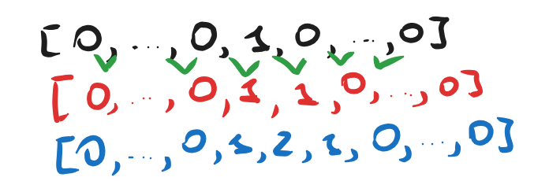

Домашнее задание - знакомство с алгоритмикой и ООП, базовый питон!

Для того, чтобы эта домашка была зачтена, необходимо сделать как минимум половину заданий - то есть, 50%, **готовую домашку сдавать только в формате .ipynb**, тела реализованных функций, то есть, от слова **def**, заканчивая **return**.  Разрешено пользоваться любыми чат-ботами: ChatGPT, Gemini, GIgaChat (упаси вашу душу), но есть нюанс - сдавать будете в любом случае вы, так что в коде разобраться придется :)

Наш сегодняший герой - Денис. Денис только что поступил в универ, и с ужасом осознал, как много он забыл за время подготовки к ЕГЭ, да и лето, все дела... В общем, дела плохи!

## $1.$ Функция $x^n$

Как мы уже с вами знаем, в языке Python существуют такие объекты как функции. Однако Денис так и не уловил, как именно нужно возводить в степень в алгоритмике - помогите Денису, пожалуйста, у него и так остальная учеба горит... 
Сегодня вашим встречающим заданием станет реализация такой функции как в заголовке, итак, я вам даю начало, а вы заканчиваете, сегодня правила такие. **ЗАПРЕЩАЕТСЯ** использовать встроенный в Python оператор ** . Подсказка: просто сделайте как делали сами при возведении в степень, и всё заработает

```python
def x_powered(x: float = 1, n: int = 1) -> float:
	accumulator = 1
	#<...>
	# Внутри функции происходит возведение числа x в степень n. Всё куда просто, пока n является int
	#<...>
	pass
	# После реализации вашей функции она должна возвращать число, полученное в результате возведения в степень, pass быть не должно
```

## $2.$ Функция max

Также мы с вами уже знакомы с таким типом в Python как list, или по другому список.  Физрук на паре фры решил вспомнить школьные времена, и попытался поставить ребят в порядке возрастания. Правда, глазомер уже не тот, и найти максимального по росту он уже не в силах, помогите теперь и физруку.

Всё просто - верните максимальный из списка. Идея алгоритма такова: давайте возьмем первый элемент и объявим его максимумом. После чего рассмотрим второй элемент, и если он больше нашего максимума, то этот элемент становится новым максимумом.

### **Пример**:  $list = [5, 6, 2, 1, 2, 8]$

### Шаг 1. Берем 0-ой элемент. В нашем случае это будет 5.
### Шаг 2. Объявляем его максимумом, условно $max = list[0]$ 
### Шаг 3. Берем 1-ый элемент. Это будет число 6.
### Шаг 4. Сравниваем его с нашим максимумом. Он больше него? Ответ: да! Тогда приравниваем наш max к 6, $max = list[1]$

И так далее шаги...

```python
def max_list(list_of_numbers: list = []) -> float: 
## Реализация алгоритма выше
```

## $3.$ Биномиальные коэффициенты

Вот где-то на половине слова вы можете остановиться и спросить "Что?". Всё окей, сейчас разрулим это недоразумение, и вы окажетесь чуть эрудированнее, чем минут за 5 до этого.

Итак, где бы вы ни оказались - в математике, программировании или машинном обучении, вы можете неожиданно столкнуться с биномиальными коэффициентами. Правда, вот незадача - звучит чертовски противно, а если загуглить напрямую, то может и поплохеть. 

Впервые этой проблемой давным-давно заинтересовался Блез Паскаль (да-да, тот самый, про которого анекдот с Ньютоном, можете тоже загуглить :). Он-то собственно и предложил первый способ расчета биномиальных коэффициентов еще не подозревая, для чего же это понадобится в будущем.

###  **Пример:** 
### 1. возьмем обычный список $[0, 1, 0]$, только уточним, что он окружен нулями, то есть, выглядит он на самом деле как $[0,...,0,1,0...0]$
### 2. Теперь сделаем следующее - а попробуем построить еще один список под ним на по следующему правилу: будем для одного элемента из нижнего списка суммировать два элемента верхних списков.  

### Думаю, примерно понятно, что выйдет примерно следующее $[0,...,0, 1, 1, 0,...,0]$. Как это получилось? 


### $[1, 1]$ получились в списке из-за того, что мы просуммировали единицу два раза - с левым и правым нулём. 

### 3. Построим следующий этаж по такому же правилу:


*P.S.* : если всё равно не дошло, как строится зависимость, то есть[ такой видосик](https://www.youtube.com/shorts/4F-otSBWOPs?feature=share) хороший, ещё и шорц, какая экономия времени! 

Итак, ваше боевое задание сейчас это реализовать функцию, которая будет выводить n-ую строку треугольника Паскаля, то есть, банально возвращать список биномиальных коэффицентов.

```python
def n_row_pascal_triangle(n: int = 0) -> list:
	base = [[0, 1, 0]]
	# <...>
	# Ваша реализация алгоритма выше здесь
	# <...>
	pass
```


## $4.$ Сортировка пузырьком

Последнее сегодня по алгоритмике, но не последнее по важности - сортировка. Вы можете сказать "Погоди, но ведь все сортировки уже реализованы, и даже в python есть метод **sort()**". Да, - отвечу я -, Вы правы, но есть нюанс. Вы уже так три раза сегодня сделали, и четвертый придется :))))

Возвращаемся к Денису и его физруку - хорошо, мы нашли самого высокого. Но как их теперь упорядочить?... Брать постоянно максимум от списка, ставить его на 1 позицию, и потом искать максимум от нового списка?... Плохо звучит, ой плохо! Давайте сделаем немного продуманнее. **Учтите:** на физре первыми всегда стоят те, кто выше (то есть, больше).

*Идея:* будем брать каждый раз пару элементов от списка, и сравнивать их между собой - если первый элемент меньше второго в этой паре, то оставляем его на позиции, если нет, то меняем их между собой.

### Пример:

Для примера возьмем произвольный список.


Этот список я взял из головы - ничего такого, теперь попробуем его отсортировать.

Шаг 1. Возьмем пару (1, 6). 6 больше 1? Ответ очевиден. Меняем местами.


Шаг 2. Берем теперь пару (1, 8). 8 больше 1? Однозначно! Меняем.


Шаг 3. Ну вы поняли, да? Дальше то же самое, и в том же духе :)

```python
def sort_list(lst: list = None) -> list:
# Итак, эта функция должна принимать список любой, и возвращать этот же список, но уже отсортированный, удачи!
pass
```

## $5^*$. Класс нейронной сети

Что, уже испугались? Ладно-ладно, пугать дальше не буду - задание не будет состоять в том, чтобы настоять реальную и работующую нейронную сеть :)

У Дениса произошел на фоне всей этой истории в универе сдвиг в плане восприятия, и он завел себе домашнее животное с кличкой *Нейросеть*, оказалось, что нейросеть ест столько данных во время прямого прохода, что не по себе становится, еще и иногда бэкпроп за ней приходится убирать... В общем, вам нужно реализовать достаточно простой класс, имеющий следующий интерфейс

```python
class NeuralNetwork():
def __init__(self, weight: int = 1, nick: str = None):
	# здесь необходимо установить для объекта все его параметры, например self.weight = weight, и далее по списку

def forward(self, data: list = None) -> None:
# Реализуйте метод, который будет умножать каждое число списка data умножать на коэффициент self.weight, после чего сохранять его в модели как атрибут 

def backward(self, loss: float = 6e-3) -> list:
# Поделите каждый элемент выхода с forward на коэффициент loss, и верните результирующий список
```

Далее, вам нужно будет установить библиотеку numpy к себе на компьютер, либо использовать Colab (да, настолько серьезное задание), и скопировать следующий код, после чего вставить к себе. Вуаля, задание всё.

```python
import numpy as np

nn = NeuralNetwork(weight = 3, nick = "doggy")
data = np.random.rand(100, 1)[0]

nn.forward(data)
loss = np.random.rand(1)[0]

prediction = nn.backward(loss)

print(prediction)
```
