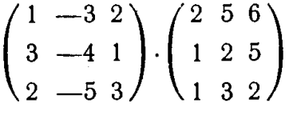

Добро пожаловать в удивительный мир математики - ваше сегодняшнее путешествие спонсировано нашими потребностями в том, чтобы вы хотя бы немного вспомнили школьный курс математики. Готовы? Нет? Ну, мы всё равно начнем. 

Условия: для того, чтобы эта домашка была зачтена, достаточно сделать 30%. Не хочется, чтобы кто-то загонялся насчет того, что не может сделать дз, поэтому такие условия :) **Сдавать домашку только в формате .pdf** (фото из тетради при хорошем освещении, либо написанное на графе. 
Разрешено пользоваться любыми чат-ботами, но опять-таки: сдавать будут не они, а вы, так что понимать происходящее тут обязательно. 

Итак, сегодня у нас на препарировании пять заданий, которые покрывают 95% математики, что вам встретится. 

# 1. Считаем скалярное произведение!

**УРА!** 

Самое простое за сегодня - хотя важность этой операции переоценить тяжело. Скалярное произведение - в бой, особо разглагольствовать не будем, перейдем как поистине русские люди сразу к сути дела

## 1. 1 Итак, у вас есть два вектора:

# $\vec{x}=[2, 8, 1]$

# $\vec{y}=[3, 12, -1]$

Найдите скалярное произведение этих двух векторов, а также оцените, какой угол между ними. 

Вы должны уловить четко одну мысль из скалярного произведения, для этого сделаем такую вещь.

## 1.2 Снова даны два вектора, но другие, предположим:

# $\vec{t} = [2, 3]$

# $\vec{z}=[3, 2]$

Нарисуйте их на плоскости декартовой системы координат (поставьте точки соответственно координатам, то есть, точка для вектора t будет находиться по x=2 и y=3), после чего проведите стрелочки от начала координат до построенных вами точек. 

Построили. Теперь попробуйте их сравнить. В плане, ну как числа. Всё ж просто. (Нет, вообще не просто, это и есть проблема). Весь нюанс в том, что наши векторы имеют по две координаты - окей, мы как бы можем на пальцах предположить, что там координата x важнее и давайте по ней всё считать, вектор z победил, ура! 

Ну вроде и можно, в конце-концов не звучит уж очень противоестественно, но хочется две координаты всё-таки учитывать, а не одну, и сравнить всё равно хочется... Смотрите, тут неожиданно вылезают два вот таких вектора

# $\vec{i}=[1,0]$
# $\vec{j}=[0,1]$

Примите это как факт, что есть два вектора с такими названиями. 

А теперь найдите скалярные произведения векторов i,t и j,z. Получилось? Несложно, да? Сравните их. Тоже ведь стало куда проще? 

Теперь время умных слов: скалярное произведение позволяет перевести ваш вектор из многомерного вида (когда у него куча чисел) в такой вот, когда его характеризует всего одно число. Если записывать это сложно, то будет примерно

# $\mathbb{V}\times\mathbb{V}\rightarrow\mathbb{R}$

Здесь записано то же самое, что я проговорил выше, но формальным языком. Мой долг как преподавателя выполнен!

# 2. Считаем производную! 

Этот раздел посвящен другой задаче, с которой всегда сталкиваются в рамках глубокого (машинного в том числе) обучения. Считать эти ваши производные. Кто-то может схватиться за голову и закричать "АААА, НЕТ, ТОЛЬКО НЕ СНОВА, ПРОКЛЯТАЯ МАТЕМАТИКА!!!". 

Не переживайте, мы сегодня на вайбе объяснений, поэтому что-то из этого пункта вы для себя точно также вынесете.

## 2.1 Начинаем

# $f(x) = x^2+2x$

Давайте попробуем найти минимум заданной выше функции. 

Нужно вспомнить теорему из первого курса матана. У кого-то сейчас могут начаться вьетнамские флэшбеки про кошмарную зимнюю сессию, как надеялись, что это побыстрее закончится и никогда больше не вернется... Вернулось, но мы с вами обсудим это немного иначе. 

**Теорема Ферма (о нулях производной):** 

Пусть функция $f(x$)$ дифференцируема в точке $x_0$ и пусть $x_0$ является точкой локального экстремума функции $f(x)$. Тогда

# $f'(x_0)=0$

Кошмар. Просто ужас. Но смысл на поверхности. Попробуем найти минимум следующей функции $f(x) = e^x − 2x$.

Ну, тут знакомые с программированием ребята могут броситься решать - вычислять значение функции в каждой точке, и просто выбрать минимальное, всё-таки в прошлый раз реализовывали `max` , теперь просто `min` сделаем, и в путь, но есть нюанс: в действтельных числах **НЕСЧЕТНАЯ БЕСКОНЕЧНОСТЬ ЧИСЕЛ**. Проще говоря - настолько много, что никто из нас и представить физически не может. И как перебирать? И вообще - что с этим делать?.. И такие случаи бывают **ОЧЕНЬ** часто. Зато можно применить озвученную выше теорему. 

Ну что же, считаем производную.

# $f'(x)=e^x-2$

Теперь приравниваем полученное выражение к нулю, и...

# $e^x-2=0$

Аналогичное проделать для функции из заголовка. 

Теперь еще два примера без разбора, я в вас верю.

# $f(x) = 2\sin(x)+1$
# $f(x)=\log_2x+3$

# 3. Нахождение нормы вектора и произведения матриц 

(Почти) заключительный этап сегодняшней экзекуции - будем считать произведение матриц и норм векторов. 

И снова - первая мысль, пронесшаяся у вас в голове это, наверное, "Опять душниловка..." 

Но не тут то было! На самом деле, операция произведения матриц является одной из самых оптимиизированных в мире, поскольку **она вообще везде**. Вы этого не видите и не слышите, но 95% вычислительных задач с большим количеством подсчета пытаются свести именно к матричному умножению. Почему? 

Посудите сами, изначально матричное умножение имеет сложность $O(N^3)$. Что это значит? Давайте на примере: для умножения матриц размером 1 млн элементов на 1 млн элементов обе, вам потребуется примерно вот столько операций, а может и больше 

# $18.000.000.000.000.000.000$

Внушает, да? Ладно, с учетом современных мощностей произведение такого количества операций займёт всего часов 10 на обычном домашнем процессоре, но вот незадача - **умножаются матрицы куда больше размера** и обычно надо умножить не две матрицы, а так пару сотен тысяч... Поэтому алгоритм умножения матриц стараются изо всех сил оптимизировать и сейчас дошли до сложности $O(N^1.725)$, что дает куда более приятные результаты. 

Однако мы сегодня займемся с вами не оптимизацией матричного умножения, а его выполнением ручками. Необходимо умножить две матрицы следующего вида:

(Я честно хотел всё по красоте формулками сделать, но .md не дал :( )

Кому необходимо много повторения умножения матриц (или же умножения матриц в принципе не было - [велкам](https://mephi-docs.readthedocs.io/ru/latest/_static/literature/%D0%9F%D1%80%D0%BE%D1%81%D0%BA%D1%83%D1%80%D1%8F%D0%BA%D0%BE%D0%B2_%D1%81%D0%B1%D0%BE%D1%80%D0%BD%D0%B8%D0%BA_%D0%B7%D0%B0%D0%B4%D0%B0%D1%87_%D0%BF%D0%BE_%D0%BB%D0%B8%D0%BD%D0%B5%D0%B9%D0%BD%D0%BE%D0%B9_%D0%B0%D0%BB%D0%B3%D0%B5%D0%B1%D1%80%D0%B5.pdf))

После выполнения этой на самом деле реально непростой операции (запутаться и потеряться 10 раз можно), с вас могло бы хватить на сегодня, но есть и последняя задачка. 

Как мы уже с вами обсуждали сегодня - не всегда нам нравится обычная форма вектора, когда он записан в координатах. Особенно непонятно, какая у него длина... 

В плане, вот вектор, например

# $\vec{x}=[1,2,3,4,5,6,7]$

И какая длина у этого семимерного чудовища??? Что такое вообще длина в семимерном пространстве????????

И так математики снова ввели обобщенное понятие - норма. Норма - это длина вектора для любой его размерности - хоть 7 координат, хоть 100, хоть пару миллионов. Нормой вектора называется результат вычисления выражения следущего вида, то есть, нормой вектор n-мерного пространства

# $||x||_n=\sqrt[n]{\sum_{i=1}^n|x_i^n|}$

И частный случай этой формулы это

# $||x||_2=\sqrt{x_1^2+x_2^2}$
Узнаете здесь теорему Пифагора? А она есть! Итак, ваша последняя задача, посчитать норму следующих двух векторов

# $\vec{x}=[6,8]$

# $\vec{y} = [2, 2, 3]$

P.S.: кстати, эта штука называется нормой $L_2$.

# 4*. Оптимизация

АТЕНШН: это можно не делать, просто вдруг кому-то захочется.

Из хода лекции я узнал, что как минимум 10 человек обладают хорошей математической базой. Специально для вас.

Найти минимум и максимум функции $z = x - 2y$ в круге $x^2+y^2 <= 2y$.

Всем успехов!

